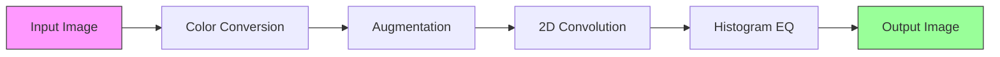

# cuda-imgproc

**A header-only C++17/CUDA library for GPU-accelerated image processing, built from scratch with no external dependencies.**

---

## Motivation

Image processing operations — convolution, histogram equalization, augmentation, color conversion — are the backbone of computer vision and deep learning preprocessing pipelines. Every time you train a neural network on images, hundreds of thousands of images pass through these operations before they ever reach the model.

**The problem is speed.**

A single 1024x1024 RGB image has over 3 million pixel values. A 2D convolution with a 5x5 kernel requires 75 multiply-add operations *per output pixel* — that's 78 million floating-point operations for one image. Now multiply that by 10,000 images in a training batch. On a CPU, these operations run sequentially: one pixel after another, one image after another. A batch augmentation step that should take milliseconds ends up taking minutes.

**The opportunity is parallelism.**

These operations are *embarrassingly parallel*. Converting a pixel from RGB to grayscale doesn't depend on any other pixel. Applying a flip is just remapping coordinates. Even convolution, where each output pixel depends on a neighborhood of input pixels, can be decomposed into thousands of independent local computations. GPUs have thousands of cores designed for exactly this workload — an NVIDIA GPU can launch hundreds of thousands of threads that execute simultaneously.

**Why not just use OpenCV?**

OpenCV has a CUDA module, and it's excellent. But it's also 2+ million lines of code. When you call `cv::cuda::cvtColor()`, you get a result — but you don't learn anything about what happened inside the GPU. You don't understand why shared memory matters for convolution, or why atomic operations are needed for histograms, or how memory coalescing affects throughput by 10x.

**This project builds everything from scratch.** Every kernel is written by hand. Every memory transfer is explicit. The goal is to understand GPU programming at the hardware level — what the threads are doing, how they access memory, where the bottlenecks are, and how to optimize around them. Then, to prove it works, benchmark everything against CPU baselines and show the speedups.

---

## What I'm Building

The library will implement a 4-stage image processing pipeline. Each stage introduces progressively more advanced CUDA concepts, from basic thread indexing to shared memory tiling to atomic operations and parallel scans.

### Stage 1: Color Space Conversion

**CUDA Concepts: Kernel launch, thread indexing, global memory**

The simplest possible GPU kernel — every pixel is completely independent. No data dependency between pixels, no neighbor access, no synchronization, no shared state. This is the purest expression of GPU parallelism.

**Planned operations:**
- RGB to Grayscale (weighted luminance sum using BT.601 coefficients)
- RGB to HSV (min/max decomposition of RGB channels)

This stage is about learning the fundamentals: how to launch a kernel, how threads map to data elements, how to choose block sizes, and why boundary checks matter.

---

### Stage 2: Image Augmentation

**CUDA Concepts: 2D grids, coordinate mapping, memory coalescing**

Geometric transformations that remap pixel coordinates — the output at `(x, y)` reads from a computed source location in the input.

**Planned operations:**
- Horizontal and vertical flip
- Rotation by arbitrary angle with bilinear interpolation
- Resize with nearest-neighbor and bilinear interpolation
- Batch processing — apply the same transform to thousands of images in a single kernel launch

This stage introduces 2D thread grids and the importance of memory access patterns — why accessing pixels row-by-row (coalesced) is dramatically faster than column-by-column (strided).

---

### Stage 3: 2D Convolution

**CUDA Concepts: Shared memory, tiling, halo regions, thread synchronization**

This is the most important operation in the library. 2D convolution is what every convolutional layer in a CNN does — it slides a small kernel over the image and computes a weighted sum at each position. It's also the operation where naive GPU code leaves the most performance on the table.

**Planned operations:**
- Generic 2D convolution with configurable kernel size (3x3, 5x5, 7x7, ...)
- Gaussian blur
- Sobel edge detection (horizontal and vertical gradients)
- Laplacian edge detection
- Custom sharpening kernel

**The key optimization:** Adjacent output pixels share most of their input neighborhoods. A naive approach re-reads overlapping pixels from slow global memory every time. The plan is to use shared memory tiling — each thread block loads a tile of input (plus halo borders) into fast on-chip shared memory, then all threads compute using the shared copy. This reduces global memory reads by a factor proportional to the kernel size.

---

### Stage 4: Histogram Equalization

**CUDA Concepts: Atomic operations, parallel reduction, prefix scan**

Histogram equalization enhances image contrast by redistributing pixel intensities to span the full 0–255 range. It's a three-pass algorithm where each pass introduces a different GPU programming challenge:

1. **Compute histogram** — thousands of threads may try to increment the same bin simultaneously, requiring atomic operations to avoid race conditions
2. **Compute CDF via prefix sum** — a parallel scan over the histogram, one of the fundamental GPU primitives that shows up in sorting, stream compaction, and many other algorithms
3. **Remap pixel values** — apply the normalized CDF as a lookup table

**Possible extension — CLAHE:** Contrast Limited Adaptive Histogram Equalization, which operates on local tiles rather than the full image. Used in medical imaging and satellite imagery for local contrast enhancement.

---

## Benchmarking Plan

Every operation will be benchmarked with three implementations to show where GPU acceleration matters and by how much:

| Implementation | Description |
|---|---|
| **CPU single-thread** | Vanilla C++ with nested loops |
| **CPU multi-thread** | Parallelized across CPU cores with OpenMP |
| **CUDA GPU** | Full GPU kernel with appropriate optimizations |

**What will be measured:**
- Per-image latency at increasing resolutions (256x256 up to 4096x4096)
- Batch throughput (images/second) at various batch sizes
- GPU kernel time both with and without host-device memory transfer overhead
- Speedup curves, latency vs resolution, throughput comparisons

**Methodology:** Warm-up iterations before measurement, 100 timed runs per configuration (reporting median and std dev), `cudaEvent` timing for GPU and `std::chrono` for CPU.

---

## Design Decisions

- **Header-only library** — every operation lives in a single `.cuh` file, no separate compilation or linking needed
- **RAII memory management** — GPU memory wrapped in a move-only buffer type that frees on destruction, no manual `cudaFree()` calls
- **Explicit error checking** — every CUDA API call wrapped in an error-checking macro
- **Minimal external dependencies** — only [stb_image.h](https://github.com/nothings/stb) for PNG/JPG loading and saving

---

## CUDA Concepts Covered

| Stage | Concepts | Difficulty |
|---|---|---|
| Color conversion | Kernel launch, 1D thread indexing, global memory, boundary checking | Beginner |
| Augmentation | 2D thread grids, coordinate remapping, memory coalescing | Beginner |
| 2D Convolution | Shared memory, tiling, halo regions, thread synchronization, bank conflicts | Intermediate |
| Histogram EQ | Atomic operations, race conditions, parallel prefix scan | Advanced |
| Batch processing | CUDA streams, concurrent kernels, pinned memory, async transfers | Advanced |
| Benchmarking | `cudaEvent` timing, occupancy analysis, memory bandwidth calculation | Intermediate |

---

## Prerequisites

| Requirement | Minimum Version |
|---|---|
| NVIDIA GPU | Compute Capability 6.0+ (Pascal or newer) |
| CUDA Toolkit | 11.0+ |
| C++ Compiler | g++ 9+ or clang 10+ (C++17 support) |
| Build System | Make or CMake 3.18+ |

---

## Project Status

- [ ] Project structure and documentation  **<-- current**
- [ ] Color space conversion kernels (RGB to Gray, RGB to HSV)
- [ ] Image augmentation kernels (flip, rotate, resize)
- [ ] 2D convolution with shared memory optimization
- [ ] Histogram equalization with atomic operations
- [ ] CPU baseline implementations (single-threaded + OpenMP)
- [ ] Benchmark suite with automated timing
- [ ] Performance report with visualizations
- [ ] Batch processing with CUDA streams

---

## References

1. **NVIDIA CUDA C++ Programming Guide** — [docs.nvidia.com/cuda/cuda-c-programming-guide](https://docs.nvidia.com/cuda/cuda-c-programming-guide/)
2. **Programming Massively Parallel Processors** — David B. Kirk & Wen-mei W. Hwu (4th Edition)
3. **NVIDIA CUDA Samples** — [github.com/NVIDIA/cuda-samples](https://github.com/NVIDIA/cuda-samples)
4. **stb_image.h** — Sean Barrett — [github.com/nothings/stb](https://github.com/nothings/stb)
5. **Parallel Prefix Sum (Scan) with CUDA** — GPU Gems 3, Chapter 39

---

## Author

**Anmol Goyal** — [anmol-goyal7.github.io](https://anmol-goyal7.github.io)
