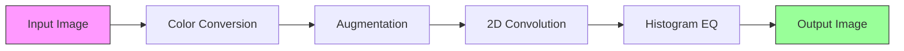

# cuda-imgproc

**A header-only C++17/CUDA library for GPU-accelerated image processing, built from scratch with no external dependencies.**


---

## Motivation

Image processing operations — convolution, histogram equalization, augmentation, color conversion — are the backbone of computer vision and deep learning preprocessing pipelines. Every time you train a neural network on images, hundreds of thousands of images pass through these operations before they ever reach the model.

**The problem is speed.**

A single 1024x1024 RGB image has over 3 million pixel values. A 2D convolution with a 5x5 kernel requires 75 multiply-add operations *per output pixel* — that's 78 million floating-point operations for one image. Now multiply that by 10,000 images in a training batch. On a CPU, these operations run sequentially: one pixel after another, one image after another. A batch augmentation step that should take milliseconds ends up taking minutes.

**The opportunity is parallelism.**

These operations are *embarrassingly parallel*. Converting a pixel from RGB to grayscale doesn't depend on any other pixel. Applying a flip is just remapping coordinates. Even convolution, where each output pixel depends on a neighborhood of input pixels, can be decomposed into thousands of independent local computations. GPUs have thousands of cores designed for exactly this workload — an NVIDIA GPU can launch hundreds of thousands of threads that execute simultaneously.

**Why not just use OpenCV?**

OpenCV has a CUDA module, and it's excellent. But it's also 2+ million lines of code. When you call `cv::cuda::cvtColor()`, you get a result — but you don't learn anything about what happened inside the GPU. You don't understand why shared memory matters for convolution, or why atomic operations are needed for histograms, or how memory coalescing affects throughput by 10x.

**This project builds everything from scratch.** Every kernel is written by hand. Every memory transfer is explicit. The goal is to understand GPU programming at the hardware level — what the threads are doing, how they access memory, where the bottlenecks are, and how to optimize around them. Then, to prove it works, benchmark everything against CPU baselines and show the speedups.

---

## What I'm Building — The Pipeline

The library implements a 4-stage image processing pipeline. Each stage introduces progressively more advanced CUDA concepts, from basic thread indexing to shared memory tiling to atomic operations and parallel scans.



### Stage 1: Color Space Conversion

**Difficulty: Beginner | CUDA Concepts: Kernel launch, thread indexing, global memory**

The simplest possible GPU kernel — every pixel is completely independent.

**Operations:**
- **RGB to Grayscale**: Weighted luminance sum using BT.601 coefficients: `Y = 0.299R + 0.587G + 0.114B`
- **RGB to HSV**: Standard conversion via min/max decomposition of RGB channels

**Why this is a good first kernel:** There is zero data dependency between pixels. Thread `i` reads pixel `i`, computes a result, and writes it. No neighbor access, no synchronization, no shared state. This is the purest expression of GPU parallelism — map a function over a flat array.

**What you learn:** How to launch a kernel, how `blockIdx.x * blockDim.x + threadIdx.x` maps a thread to a data element, how to choose block sizes, and why you need boundary checks when the array length isn't a multiple of the block size.

```cuda
__global__ void rgb_to_gray(const uint8_t* __restrict__ in,
                            uint8_t* __restrict__ out,
                            int N) {
    int i = blockIdx.x * blockDim.x + threadIdx.x;
    if (i < N) {
        out[i] = static_cast<uint8_t>(
            0.299f * in[3 * i]     +
            0.587f * in[3 * i + 1] +
            0.114f * in[3 * i + 2]
        );
    }
}

// Launch: rgb_to_gray<<<(N + 255) / 256, 256>>>(d_in, d_out, N);
```

---

### Stage 2: Image Augmentation

**Difficulty: Beginner | CUDA Concepts: 2D grids, coordinate mapping, memory coalescing**

Geometric transformations that remap pixel coordinates — the output at `(x, y)` reads from a computed source location in the input.

**Operations:**
- **Horizontal / Vertical flip**: Mirror pixel coordinates along an axis
- **Rotation by arbitrary angle**: Rotate around center using a 2x2 rotation matrix, with bilinear interpolation for sub-pixel accuracy
- **Resize**: Nearest-neighbor (fast) and bilinear (smooth) interpolation
- **Batch processing**: Apply the same transform to thousands of images simultaneously — one kernel launch, all images processed in parallel

```cuda
__global__ void flip_horizontal(const uint8_t* __restrict__ in,
                                uint8_t* __restrict__ out,
                                int width, int height, int channels) {
    int x = blockIdx.x * blockDim.x + threadIdx.x;
    int y = blockIdx.y * blockDim.y + threadIdx.y;

    if (x < width && y < height) {
        int src_x = width - 1 - x;
        for (int c = 0; c < channels; c++) {
            out[(y * width + x) * channels + c] =
                in[(y * width + src_x) * channels + c];
        }
    }
}

// Launch with 2D grid:
// dim3 block(16, 16);
// dim3 grid((width + 15) / 16, (height + 15) / 16);
// flip_horizontal<<<grid, block>>>(d_in, d_out, width, height, 3);
```

**What you learn:** Moving from 1D to 2D thread grids, how to map `(blockIdx, threadIdx)` pairs to `(x, y)` pixel coordinates, and why memory access patterns matter — accessing pixels row-by-row (coalesced) is dramatically faster than column-by-column (strided).

---

### Stage 3: 2D Convolution

**Difficulty: Intermediate | CUDA Concepts: Shared memory, tiling, halo regions, `__syncthreads()`**

This is the most important operation in the library. 2D convolution is what every convolutional layer in a CNN does — it slides a small kernel (filter) over the image and computes a weighted sum at each position. It's also the operation where naive GPU code leaves the most performance on the table.

**Operations:**
- **Generic 2D convolution** with configurable kernel size (3x3, 5x5, 7x7, ...)
- **Gaussian blur**: Smoothing with a Gaussian-weighted kernel
- **Sobel edge detection**: Horizontal and vertical gradient filters
- **Laplacian edge detection**: Second-derivative filter for edges
- **Custom sharpening kernel**: Identity minus Gaussian for edge enhancement

**The problem with naive convolution:**

Each output pixel at `(x, y)` requires reading a `K x K` neighborhood from the input. For a 5x5 kernel on a 1024x1024 image, that's 25 reads per pixel, or ~26 million global memory reads total. But adjacent output pixels share most of their input neighborhoods — pixel `(x, y)` and pixel `(x+1, y)` overlap in 20 of their 25 input pixels. The naive approach re-reads these from slow global memory every time.

**The solution — shared memory tiling:**

Each thread block loads a tile of input pixels (plus halo borders) into fast on-chip shared memory. Then all threads in the block compute their output pixels using the shared copy. This reduces global memory reads by a factor proportional to the kernel size.

```
    Global Memory (slow, ~500 GB/s)
    ┌───────────────────────────────────┐
    │  Full input image                 │
    │  ┌─────────────────────┐          │
    │  │ Tile + Halo region  │──────┐   │
    │  └─────────────────────┘      │   │
    └───────────────────────────────┘   │
                                        ▼
    Shared Memory (fast, ~10 TB/s)
    ┌─────────────────────┐
    │ ┌───────────────┐   │
    │ │   Halo cells  │   │
    │ │ ┌───────────┐ │   │
    │ │ │ Core tile │ │   │
    │ │ └───────────┘ │   │
    │ └───────────────┘   │
    └─────────────────────┘
            │
            ▼
    Each thread computes ONE output pixel
    using shared memory (no global reads)
```

```cuda
__global__ void conv2d_tiled(const float* __restrict__ in,
                             float* __restrict__ out,
                             const float* __restrict__ kernel,
                             int W, int H, int K) {
    const int radius = K / 2;
    const int tile_w = blockDim.x;
    const int tile_h = blockDim.y;

    // Shared memory tile includes halo region
    extern __shared__ float tile[];
    const int shared_w = tile_w + 2 * radius;

    int tx = threadIdx.x;
    int ty = threadIdx.y;
    int out_x = blockIdx.x * tile_w + tx;
    int out_y = blockIdx.y * tile_h + ty;

    // Load core tile + halo from global memory into shared memory
    // Each thread may load multiple elements to cover the halo
    int in_x = out_x - radius;
    int in_y = out_y - radius;

    for (int dy = ty; dy < tile_h + 2 * radius; dy += tile_h) {
        for (int dx = tx; dx < tile_w + 2 * radius; dx += tile_w) {
            int gx = blockIdx.x * tile_w + dx - radius;
            int gy = blockIdx.y * tile_h + dy - radius;
            float val = 0.0f;
            if (gx >= 0 && gx < W && gy >= 0 && gy < H)
                val = in[gy * W + gx];
            tile[dy * shared_w + dx] = val;
        }
    }

    __syncthreads();

    // Compute convolution using shared memory
    if (out_x < W && out_y < H) {
        float sum = 0.0f;
        for (int ky = 0; ky < K; ky++) {
            for (int kx = 0; kx < K; kx++) {
                sum += tile[(ty + ky) * shared_w + (tx + kx)]
                     * kernel[ky * K + kx];
            }
        }
        out[out_y * W + out_x] = sum;
    }
}
```

**What you learn:** Shared memory as a programmer-managed cache, how tiling decomposes a problem into block-sized chunks, what halo regions are and why they're needed for stencil operations, `__syncthreads()` barriers, and how to avoid shared memory bank conflicts.

---

### Stage 4: Histogram Equalization

**Difficulty: Advanced | CUDA Concepts: Atomic operations, parallel reduction, prefix scan**

Histogram equalization enhances image contrast by redistributing pixel intensities so they span the full 0–255 range. It's a three-pass algorithm where each pass introduces a different GPU programming challenge.

**Pass 1 — Compute Histogram:**

Count how many pixels have each intensity value (0–255). The challenge: thousands of threads may try to increment the same bin simultaneously. Without protection, you get race conditions and wrong counts.

```cuda
__global__ void histogram(const uint8_t* __restrict__ img,
                          int* __restrict__ hist,
                          int N) {
    // Per-block histogram in shared memory to reduce contention
    __shared__ int local_hist[256];

    int tid = threadIdx.x;
    if (tid < 256) local_hist[tid] = 0;
    __syncthreads();

    int i = blockIdx.x * blockDim.x + threadIdx.x;
    if (i < N) {
        atomicAdd(&local_hist[img[i]], 1);
    }
    __syncthreads();

    // Merge local histograms into global histogram
    if (tid < 256) {
        atomicAdd(&hist[tid], local_hist[tid]);
    }
}
```

**Pass 2 — Compute CDF (Prefix Sum):**

The cumulative distribution function is a prefix sum (scan) over the histogram. Prefix scan is one of the fundamental GPU primitives — it shows up in sorting, stream compaction, radix sort, and dozens of other algorithms.

```cuda
// Blelloch exclusive scan (in-place, power-of-2 array)
__global__ void prefix_scan(int* data, int N) {
    extern __shared__ int temp[];
    int tid = threadIdx.x;
    temp[tid] = data[tid];
    __syncthreads();

    // Up-sweep (reduce)
    for (int stride = 1; stride < N; stride *= 2) {
        int idx = (tid + 1) * 2 * stride - 1;
        if (idx < N)
            temp[idx] += temp[idx - stride];
        __syncthreads();
    }

    // Down-sweep
    if (tid == 0) temp[N - 1] = 0;
    __syncthreads();

    for (int stride = N / 2; stride >= 1; stride /= 2) {
        int idx = (tid + 1) * 2 * stride - 1;
        if (idx < N) {
            int t = temp[idx - stride];
            temp[idx - stride] = temp[idx];
            temp[idx] += t;
        }
        __syncthreads();
    }

    data[tid] = temp[tid];
}
```

**Pass 3 — Remap Pixel Values:**

Apply the normalized CDF as a lookup table to remap every pixel to its equalized value.

```cuda
__global__ void equalize(const uint8_t* __restrict__ in,
                         uint8_t* __restrict__ out,
                         const int* __restrict__ cdf,
                         int cdf_min, int N) {
    int i = blockIdx.x * blockDim.x + threadIdx.x;
    if (i < N) {
        out[i] = static_cast<uint8_t>(
            roundf(((float)(cdf[in[i]] - cdf_min) / (N - cdf_min)) * 255.0f)
        );
    }
}
```

**Optional extension — CLAHE:** Contrast Limited Adaptive Histogram Equalization divides the image into tiles, computes a local histogram and CDF for each tile, clips the histogram to limit amplification, and interpolates between neighboring tiles for smooth results. This is what medical imaging and satellite imagery use for local contrast enhancement.

**What you learn:** Race conditions in parallel code, atomic operations as a correctness mechanism, the performance cost of atomics and how shared-memory histograms reduce contention, parallel prefix scan as a building block for many GPU algorithms, and multi-pass kernel pipelines.

---

## Benchmarking Methodology

Every operation is benchmarked with three implementations to clearly show where GPU acceleration matters and by how much.

### The Three Implementations

| Implementation | Description | Parallelism |
|---|---|---|
| **CPU single-thread** | Vanilla C++ with nested loops, one pixel at a time | None |
| **CPU multi-thread** | Same algorithm, parallelized across CPU cores with OpenMP `#pragma omp parallel for` | 8–16 threads (depends on CPU) |
| **CUDA GPU** | Full GPU kernel with appropriate optimizations (shared memory, coalesced access, etc.) | 10,000+ concurrent threads |

### What We Measure

**Per-image latency** at increasing resolutions:

| Operation | Resolution | CPU (ms) | OpenMP (ms) | CUDA (ms) | Speedup vs CPU |
|---|---|---|---|---|---|
| RGB → Grayscale | 256x256 | TBD | TBD | TBD | TBD |
| RGB → Grayscale | 512x512 | TBD | TBD | TBD | TBD |
| RGB → Grayscale | 1024x1024 | TBD | TBD | TBD | TBD |
| RGB → Grayscale | 2048x2048 | TBD | TBD | TBD | TBD |
| RGB → Grayscale | 4096x4096 | TBD | TBD | TBD | TBD |
| Conv2D 3x3 | 256x256 | TBD | TBD | TBD | TBD |
| Conv2D 3x3 | 512x512 | TBD | TBD | TBD | TBD |
| Conv2D 3x3 | 1024x1024 | TBD | TBD | TBD | TBD |
| Conv2D 3x3 | 2048x2048 | TBD | TBD | TBD | TBD |
| Conv2D 3x3 | 4096x4096 | TBD | TBD | TBD | TBD |
| Conv2D 5x5 | 1024x1024 | TBD | TBD | TBD | TBD |
| Histogram EQ | 1024x1024 | TBD | TBD | TBD | TBD |
| Histogram EQ | 4096x4096 | TBD | TBD | TBD | TBD |
| Flip H | 1024x1024 | TBD | TBD | TBD | TBD |
| Rotation 45° | 1024x1024 | TBD | TBD | TBD | TBD |

**Batch throughput** (images/second):

| Operation | Batch Size | Resolution | CPU (img/s) | CUDA (img/s) | Speedup |
|---|---|---|---|---|---|
| RGB → Grayscale | 1,000 | 512x512 | TBD | TBD | TBD |
| RGB → Grayscale | 10,000 | 512x512 | TBD | TBD | TBD |
| Conv2D 3x3 | 1,000 | 512x512 | TBD | TBD | TBD |
| Conv2D 3x3 | 10,000 | 512x512 | TBD | TBD | TBD |
| Full Pipeline | 1,000 | 512x512 | TBD | TBD | TBD |

### Methodology

- **Warm-up:** 5 warm-up iterations before measurement to ensure GPU clocks are boosted and caches are warm
- **Repetitions:** 100 timed runs per configuration, report median and standard deviation
- **Timing:** `cudaEvent` for GPU (avoids CPU-side timer overhead), `std::chrono::high_resolution_clock` for CPU
- **Transfer time:** Report GPU kernel time both with and without host↔device memory transfer overhead
- **Speedup:** `Speedup = CPU_time / CUDA_time` (higher is better)

Results will be plotted using matplotlib — speedup curves, latency vs resolution, throughput bar charts.

---

## Technical Architecture

### Design Philosophy

`cuda-imgproc` is a **header-only** library. Every operation lives in a single `.cuh` file that can be included directly — no separate compilation, no linking, no build system integration needed.

### File Structure

```
include/cuda_imgproc/
├── common.cuh        # Error checking macros, GPU memory RAII wrapper, image struct
├── color.cuh         # rgb_to_gray(), rgb_to_hsv()
├── augment.cuh       # flip_h(), flip_v(), rotate(), resize()
├── conv2d.cuh        # conv2d(), gaussian_kernel(), sobel_x(), sobel_y(), laplacian()
└── histogram.cuh     # histogram(), prefix_scan(), equalize(), clahe()
```

### Data Flow

```
┌─────────────┐     cudaMemcpy      ┌──────────────┐     Kernel      ┌──────────────┐
│ Host Memory  │  ──────────────►   │ Device Memory │  ──────────►   │ Device Memory │
│ (CPU RAM)    │   H2D transfer     │ (GPU VRAM)    │   execution    │ (result)      │
│              │                    │ input buffer  │                │ output buffer │
└─────────────┘                    └──────────────┘                └──────┬───────┘
       ▲                                                                  │
       │                              cudaMemcpy                          │
       └──────────────────────────────────────────────────────────────────┘
                                     D2H transfer
```

### Error Handling

Every CUDA API call is wrapped in an error-checking macro that reports the file, line, and error string on failure:

```cpp
#define CUDA_CHECK(call)                                                    \
    do {                                                                    \
        cudaError_t err = (call);                                           \
        if (err != cudaSuccess) {                                           \
            fprintf(stderr, "CUDA error at %s:%d — %s\n",                  \
                    __FILE__, __LINE__, cudaGetErrorString(err));            \
            exit(EXIT_FAILURE);                                             \
        }                                                                   \
    } while (0)
```

### Memory Management

GPU memory is managed through an RAII wrapper that allocates on construction and frees on destruction — no manual `cudaFree()` calls, no leaks:

```cpp
template <typename T>
struct DeviceBuffer {
    T* data = nullptr;
    size_t size = 0;

    DeviceBuffer(size_t n) : size(n) {
        CUDA_CHECK(cudaMalloc(&data, n * sizeof(T)));
    }
    ~DeviceBuffer() { if (data) cudaFree(data); }

    // Non-copyable, movable
    DeviceBuffer(const DeviceBuffer&) = delete;
    DeviceBuffer& operator=(const DeviceBuffer&) = delete;
    DeviceBuffer(DeviceBuffer&& o) noexcept : data(o.data), size(o.size) { o.data = nullptr; }
    DeviceBuffer& operator=(DeviceBuffer&& o) noexcept {
        if (data) cudaFree(data);
        data = o.data; size = o.size; o.data = nullptr;
        return *this;
    }
};
```

### Image I/O

The only external dependency: [stb_image.h](https://github.com/nothings/stb) and `stb_image_write.h` by Sean Barrett. Single-header, public domain, widely used. Handles PNG, JPG, BMP, TGA loading and saving.

---

## CUDA Concepts Covered

| Operation | CUDA Concepts | Difficulty |
|---|---|---|
| Color conversion | Kernel launch, 1D thread indexing, global memory read/write, boundary checking | Beginner |
| Augmentation | 2D thread grids (`dim3`), coordinate remapping, memory coalescing patterns | Beginner |
| 2D Convolution | Shared memory, tiling strategy, halo regions, `__syncthreads()`, bank conflicts | Intermediate |
| Histogram EQ | `atomicAdd()`, race conditions, parallel reduction, Blelloch prefix scan | Advanced |
| Batch processing | Streams, concurrent kernel execution, pinned memory, async transfers | Advanced |
| Benchmarking | `cudaEvent` timing, occupancy analysis, memory bandwidth calculation | Intermediate |

---

## Prerequisites

| Requirement | Minimum Version | Notes |
|---|---|---|
| NVIDIA GPU | Compute Capability 6.0+ | Pascal architecture or newer |
| CUDA Toolkit | 11.0+ | Includes `nvcc` compiler |
| C++ Compiler | g++ 9+ or clang 10+ | Must support C++17 |
| Build System | Make or CMake 3.18+ | CMake preferred |
| stb_image.h | Latest | Bundled in `third_party/` |

---

## Planned Build & Usage

### Building

```bash
# Clone the repository
git clone https://github.com/anmol-goyal7/cuda-imgproc.git
cd cuda-imgproc

# Build all examples
make examples

# Build and run the benchmark suite
make benchmark

# Build tests
make tests

# Run a specific example
./build/examples/conv2d_demo input.png output.png
./build/examples/grayscale_demo input.png gray_output.png
./build/examples/histogram_eq_demo input.png equalized.png
```

### API Usage

```cpp
#include "cuda_imgproc/color.cuh"
#include "cuda_imgproc/conv2d.cuh"
#include "cuda_imgproc/histogram.cuh"

int main() {
    // Load image from disk (uses stb_image internally)
    auto img = cuda_imgproc::load_image("input.png");

    // Convert to grayscale on GPU
    auto gray = cuda_imgproc::to_grayscale(img);

    // Apply 5x5 Gaussian blur
    auto blurred = cuda_imgproc::conv2d(gray, cuda_imgproc::gaussian_kernel(5));

    // Enhance contrast with histogram equalization
    auto enhanced = cuda_imgproc::histogram_equalize(blurred);

    // Save result back to disk
    cuda_imgproc::save_image("output.png", enhanced);

    return 0;
}
```

### Batch Processing

```cpp
#include "cuda_imgproc/augment.cuh"
#include "cuda_imgproc/color.cuh"

int main() {
    // Load a batch of images
    auto batch = cuda_imgproc::load_batch("dataset/train/", 10000);

    // Apply augmentation pipeline to entire batch on GPU
    auto flipped = cuda_imgproc::flip_horizontal(batch);
    auto rotated = cuda_imgproc::rotate(flipped, 15.0f);  // 15 degrees
    auto gray = cuda_imgproc::to_grayscale(rotated);

    // Save augmented batch
    cuda_imgproc::save_batch("dataset/augmented/", gray);

    return 0;
}
```

---

## Project Status

- [ ] Project structure and documentation  **← current**
- [ ] Color space conversion kernels (RGB→Gray, RGB→HSV)
- [ ] Image augmentation kernels (flip, rotate, resize)
- [ ] 2D convolution with shared memory optimization
- [ ] Histogram equalization with atomic operations
- [ ] CPU baseline implementations (single-threaded)
- [ ] OpenMP multi-threaded implementations
- [ ] Benchmark suite with automated timing
- [ ] Performance report with matplotlib visualizations
- [ ] Batch processing with CUDA streams

---

## References

1. **NVIDIA CUDA C++ Programming Guide** — [docs.nvidia.com/cuda/cuda-c-programming-guide](https://docs.nvidia.com/cuda/cuda-c-programming-guide/)
2. **Programming Massively Parallel Processors** — David B. Kirk & Wen-mei W. Hwu (4th Edition, Morgan Kaufmann)
3. **NVIDIA CUDA Samples** — [github.com/NVIDIA/cuda-samples](https://github.com/NVIDIA/cuda-samples)
4. **stb_image.h** — Sean Barrett — [github.com/nothings/stb](https://github.com/nothings/stb)
5. **Parallel Prefix Sum (Scan) with CUDA** — GPU Gems 3, Chapter 39

---

## Author

**Anmol Goyal**
B.Tech CSE, SRM Institute of Science and Technology

- GitHub: [anmol-goyal7](https://github.com/anmol-goyal7)
- Portfolio: [anmol-goyal7.github.io](https://anmol-goyal7.github.io)

---

*This repository contains project documentation and planned architecture. Implementation will begin soon.*
